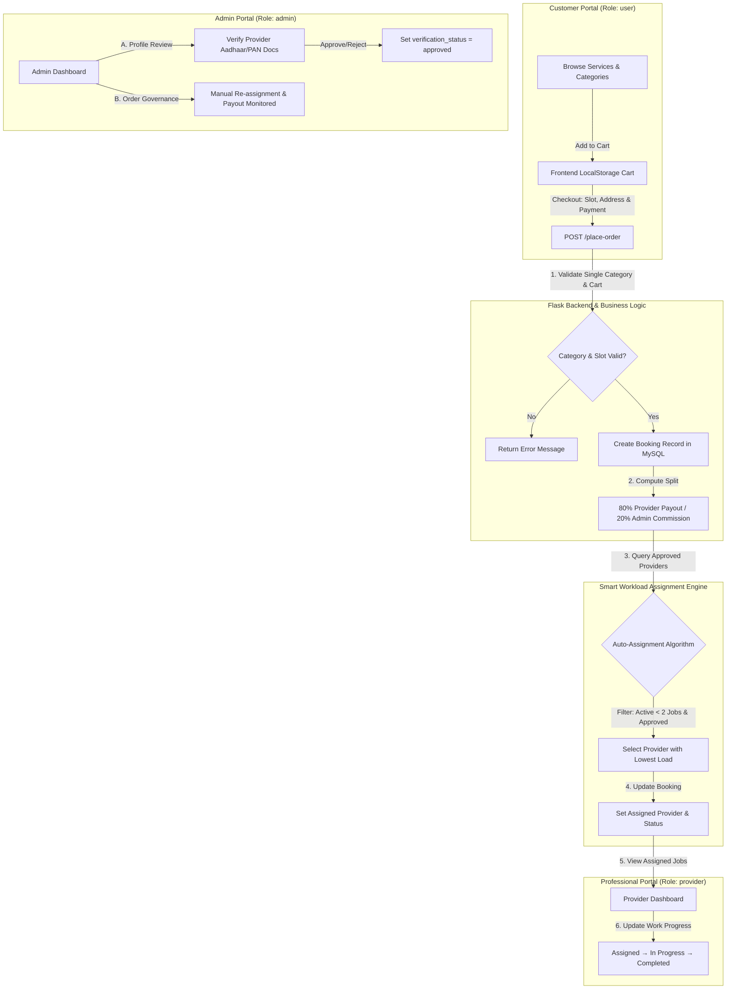

# Home Lynk — Full-Stack Service Booking & Workload Management Platform

[](https://www.python.org/)
[](https://flask.palletsprojects.com/)
[](https://www.mysql.com/)
[](https://www.sqlalchemy.org/)
[](LICENSE)

An enterprise-ready, role-based **Full-Stack Home Services Booking Platform** built with Python (Flask), MySQL, Flask-SQLAlchemy, and Jinja2. The system facilitates end-to-end service discovery, cart checkout workflows, automated provider workload assignment, administrative document verification queues, and revenue commission split tracking.

---

## 🏗️ System Architecture & Data Flow



---

## ✨ Key Features

- **👥 Multi-Tenant Role-Based Architecture**: Distinct, isolated control portals for **Customers**, **Service Professionals (Providers)**, and **System Administrators**.
- **⚡ Smart Provider Auto-Assignment**: Dynamic load-balancing algorithm that filters verified providers by service category, active status, and current active job count (< 2 jobs) to select the least-loaded provider.
- **💰 Automated Revenue Commission Split**: Built-in financial ledger that automatically divides total booking revenue into **80% Provider Payout** and **20% Admin Platform Commission**.
- **🛡️ Document Verification Pipeline**: Multi-stage provider onboarding requiring document uploads (Aadhaar, PAN, GST) stored with strict role-based document access controls.
- **🛒 Single-Category Checkout Guard**: Business validation logic ensuring cart items match a single service category per order to simplify professional assignment.
- **📍 Location & Address Intelligence**: Integrated address autocomplete with Google Places API and device geolocation detection for precision service dispatch.

---

## 🛠️ Technology Stack

| Layer | Technology |
| :--- | :--- |
| **Backend Framework** | Python 3.10+, Flask, Jinja2 Templating |
| **Database & ORM** | MySQL 8.0, Flask-SQLAlchemy, PyMySQL |
| **Frontend Scripting** | Vanilla JavaScript (ES6+), LocalStorage Cart State |
| **Styling & Assets** | Custom CSS3, Responsive Layouts, Video Assets |
| **Security & Auth** | Werkzeug Password Hashing (`scrypt`), Role-Based Session Middleware |
| **Location Services** | Google Places Autocomplete API, HTML5 Browser Geolocation |
| **Documentation** | SQL Schema (`schema.sql`), Study Guide (`PROJECT_GUIDE.md`), Markdown |

---

## 📂 Project Structure

```text
.
├── app.py                     # Main Flask entrypoint, models, routes & business logic
├── schema.sql                 # Database schema definitions & seed demo accounts
├── PROJECT_GUIDE.md           # Comprehensive study guide, route matrix & viva notes
├── README.md                  # Detailed system documentation & setup guide
├── static/                    # Static assets
│   ├── css/                   # Stylesheets (base, dashboard, cart, service styles)
│   ├── js/                    # Client-side scripts (cart management, Google Maps)
│   ├── images/                # Logos, icons, and category graphics
│   └── videos/                # Service background media
└── templates/                 # Jinja2 HTML Templates
    ├── index.html             # Landing page & service category navigation
    ├── admin.html             # Admin dashboard & verification queue
    ├── professional.html      # Provider portal & job management
    ├── cart.html              # Checkout, time slot & address selection
    ├── my_orders.html         # Customer order tracking dashboard
    └── [services].html        # Dedicated sub-service category pages
```

---

## 📊 Core Database Schema

The database model (`schema.sql`) consists of 6 primary relational tables:

1. **`users`**: Authentication table storing user credentials, role (`user`, `provider`, `admin`), and personal details.
2. **`professional_profiles`**: Provider onboarding details (service category, city, verification status, active status).
3. **`professional_documents`**: Verification document uploads (Aadhaar, PAN, GST binary data & MIME types).
4. **`bookings`**: Order ledger tracking category, slot, address, status, work progress (`pending`, `assigned`, `in_progress`, `completed`), 80% professional payout, and 20% admin commission.
5. **`saved_locations`**: Customer address book linked to checkout requests.
6. **`contact`**: User support and contact message log.

---

## 🚀 Installation & Setup

### 1. Clone the Repository

```bash
git clone https://github.com/samaspoorthireddy/service-booking-platform.git
cd service-booking-platform
```

### 2. Set Up Virtual Environment & Dependencies

```bash
python3 -m venv venv
source venv/bin/activate
pip install flask flask-sqlalchemy pymysql werkzeug
```

### 3. Initialize MySQL Database

Create a MySQL database and import the schema and seed accounts:

```bash
mysql -u root -p -e "CREATE DATABASE IF NOT EXISTS homelynk;"
mysql -u root -p homelynk < schema.sql
```

### 4. Run the Application

```bash
python app.py
```

Access the application in your browser at `http://127.0.0.1:5000/`.

---

## 🔑 Pre-Configured Seed Accounts

For quick local testing and evaluation, the following pre-configured accounts are seeded in `schema.sql`:

| Role | Email | Purpose |
| :--- | :--- | :--- |
| **Admin** | `admin@gmail.com` | Access `/admin` dashboard, verify profiles & assign jobs |
| **Provider** | `provider@gmail.com` | Access `/professional` portal, view assigned jobs & update progress |
| **Customer** | `user@gmail.com` | Browse services, place orders & track bookings in `/my-orders` |

---

## 👤 Author

**Sama Spoorthi Reddy**  
- **GitHub:** [@samaspoorthireddy](https://github.com/samaspoorthireddy)  
- **Role Target:** Special Engineer Trainee (Software Development / Full-Stack Web Engineering)

---

## 📜 License

This project is licensed under the MIT License - see the [LICENSE](LICENSE) file for details.
